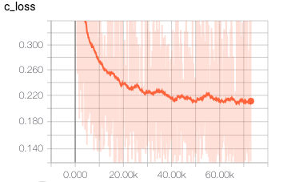
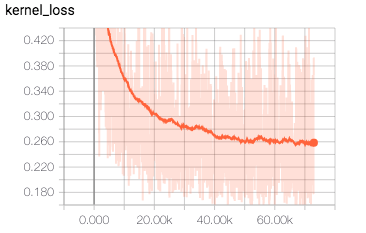
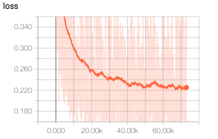
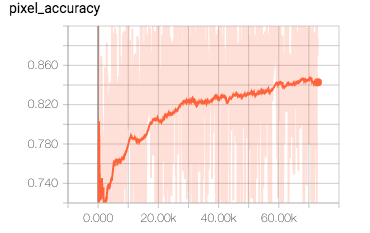

# Shape Robust Text Detection with Progressive Scale Expansion Network
A reimplement of PSENet with mxnet-gluon. Just train on ICPR.

- *Support TensorboardX*
- *Support hybridize to depoly*

Thanks for the author's (@whai362) great work!

## Requirements

- Python 2.7
- mxnet1.4.0
- pyclipper
- Polygon2
- OpenCV 4+ (for c++ version pse)
- TensorboardX

## Introduction

To reimplement PSENet by Gluon, here are some problem that I occur.

#### Diceloss about kernels isn't convergence.

- First, I doubt the label about kernel is not correct. However, I verify them again so that they are absolute right.
- Second, I doubt the `mx.nd.split` cannot be backward. But the score map from results of `split`. So it cannot be raise this problem
- Here the network is based on resnet50, and the output of FPN is *input_size/4*,so there may not be any text instance in min_kernel_map. So I set the number of kernels to *3*

Maybe upsampling output to input_size is a good choice. I will try it in my spare time.


## Usage  

#### Pretrained-models

- [gluoncv_model_zoo](https://gluon-cv.mxnet.io/model_zoo/classification.html):**resnet50_v1b**, you can replace it with others，the default path of pretrained-model in `~/.mxnet/`

Also you can download maskrcnn_coco from `gluoncv_model_zoo` to get a warm start.

#### Make
```
cd pse
make
```
Here I add `-Wl,-undefined,dynamic_lookup` to avoid some compile error, which is different from original PSENet.

#### Train  

```
python scripts/train.py $data_path $ckpt
```
- `data_path`: path of dataset, which the prefix of image and annoation must be same, for example, a.jpg, a.txt  
- `ckpt`: the filename of pretrained-mdel  

#### Loss curve:

|  |  |  |  |
| :----------------------------------------------------------: | :----------------------------------------------------------: | :----------------------------------------------------------: | :----------------------------------------------------------: |
|                          Text loss                           |                         Kernel loss                          |                           All_loss                           |                        Pixel_accuracy                        |

#### Some Results


#### Inference  

```
python eval.py $data_path $ckpt $output_dir $gpu_or_cpu
```


#### TODO:

- Upsamping to input_size
- Train on ICDAR and evaluate 

### References  

- [issue 15](https://github.com/whai362/PSENet/issues/15), 
- [tensorflow_PSENET](https://github.com/liuheng92/tensorflow_PSENet) 
- [issue10](https://github.com/whai362/PSENet/issues/10)
- [PSENet](https://github.com/whai362/PSENet)

